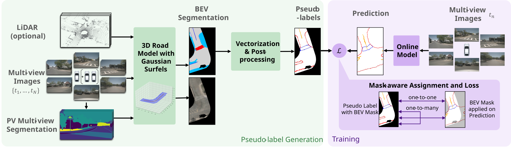

<div align="center">
<h1> PseudoMapTrainer</h1>

<h3>Learning Online Mapping without HD Maps</h3>
</div>
<p align="center">
    <a href="https://scholar.google.com/citations?user=9m868l8AAAAJ"><strong>Christian Löwens</strong></a>
    ·
    <a href="https://scholar.google.com/citations?user=VbjQxioAAAAJ"><strong>Thorben Funke</strong></a>
    ·
    <a href="https://www.linkedin.com/in/jingchao-xie-16b724297"><strong>Jingchao Xie</strong></a>
    ·
    <a href="https://www.inb.uni-luebeck.de/mitarbeiter/mitarbeiter/professoren/alexandru-condurache"><strong>Alexandru Paul Condurache</strong></a>
</p>

<h3 align="center">ICCV 2025</h3>
<p align="center">
    <!-- doc badges -->
    <a href="http://arxiv.org/abs/2508.18788">
        
    </a>
</p>

# 

https://github.com/user-attachments/assets/6102ff1c-27ce-423c-a07d-c5a88a584c64


This is the companion code for the method described in the paper *"PseudoMapTrainer: Learning Online Mapping without HD Maps"* by Löwens et al. accepted at ICCV 2025. The code allows users to reproduce and extend the results reported in the paper. Please cite the above work when reporting, reproducing or extending the results.


## Purpose of the project

This software is a research prototype, developed solely for and published as part of the PseudoMapTrainer publication. It will neither be maintained nor monitored in any way.

## Getting Started


<div align="center"></img></div>

This codebase primarily consists of three repositories: Mask2Former (see 1.1), RoGS (1.2), and MapVR (2), each adapted specifically for PseudoMapTrainer. Each repository has its own Python environment, described in detail below. Please follow these steps to generate pseudo-labels and train the online mapping model.

#### Docker (optional, required for H100/Hopper GPUs)

The [`Dockerfile`](./Dockerfile) builds all three environments into one image as three conda envs (`base` = MapVR, `rogs`, `mask2former`), on CUDA 11.8 / PyTorch 2.1. The versions pinned in the sections below (CUDA 11.1/11.3/11.6) predate Hopper's `sm_90` entirely and cannot run on an H100; the image bumps all three onto the first CUDA release that supports it.

```sh
docker build -t pseudomaptrainer .
docker run --gpus all --shm-size=16g -it \
  -v /path/to/nuscenes:/data/nuscenes \
  -v /path/to/outputs:/workspace/PseudoMapTrainer/RoGS/output \
  pseudomaptrainer

# inside the container
conda activate rogs          # RoGS stage; `conda activate mask2former` for PV segmentation
                             # the default (base) env is the MapVR training env
```

Datasets, pseudo-labels and checkpoints are mounted, not baked in — set the config paths (`base_dir`, `label_dir`, `output`, `data_root_seg`, …) to the mount points.

### 1) Generation of pseudo-labels

#### 1.1) Get PV segmentation labels ([`Mask2Former`](./Mask2Former/))
1. `cd ./Mask2Former`
1. Follow the [`INSTALL.md`](./Mask2Former/INSTALL.md)
    - We used python=3.9, torch=1.10.1+cu113, detectron2=0.6+cu113
1. Download and convert the pre-trained weights
    ```sh
    pip install timm
    wget https://github.com/SwinTransformer/storage/releases/download/v1.0.0/swin_large_patch4_window12_384_22k.pth
    python tools/convert-pretrained-swin-model-to-d2.py swin_large_patch4_window12_384_22k.pth swin_large_patch4_window12_384_22k.pkl
    ```
1. Download the [Mapillary Vistas V2](https://www.mapillary.com/dataset/vistas) dataset
1. Train the segmentation model on Mapillary V2
    ```sh
    export DETECTRON2_DATASETS=path/to/mapillary-parent-dir

    python train_net.py \
      --num-gpus 2 \
      --config-file configs/mapillary-vistas-v2/semantic-segmentation/swin/maskformer2_swin_large_IN21k_384_bs16_300k.yaml \
      SOLVER.IMS_PER_BATCH 8 SOLVER.BASE_LR 0.00008
    ```
1. Infer the segmentation for the nuScenes dataset
    ```sh
    export DETECTRON2_DATASETS=path/to/nuscenes-parent-dir

    python demo/inference.py \
      --config-file configs/mapillary-vistas-v2/semantic-segmentation/swin/maskformer2_swin_large_IN21k_384_bs16_300k.yaml \
      --base_dir path/to/nuscenes \
      --save_dir data/m2f_infer \
      MODEL.WEIGHTS output/model_xyz.pth
    ```

#### 1.2) Get vectorized map labels ([`RoGS`](./RoGS/))
1. Create a new environment with the following packages:
    - python=3.8.20
    - pip
        - addict=2.4.0
        - numpy=1.24.4
        - nuscenes-devkit=1.1.11
        - scipy=1.10.1
        - scikit-learn=1.3.0
        - setuptools=74.1.2
        - tensorboard=2.14.0
        - plyfile=1.0.3
        - pyquaternion=0.9.9
        - pyrotation=0.0.2
        - pytz=2024
        - opencv-python=4.11.0.86
        - opencv-contrib-python=4.11.0.86 
        - pytorch3d=0.7.2 (see their [requirements](https://github.com/facebookresearch/pytorch3d/blob/bd52f4a408b29dc6b4357b70c93fd7a9749ca820/INSTALL.md#core-library) and [installation instructions](https://github.com/facebookresearch/pytorch3d/blob/bd52f4a408b29dc6b4357b70c93fd7a9749ca820/INSTALL.md#2-install-wheels-for-linux))
        - torch=1.13.1+cu116
    - conda-forge
        - pyyaml=6.0.2
        - tqdm=4.66.5

1. Install the diff-gaussian-rasterization to optimize RGB:
    ```sh
    cd $HOME
    git clone --recursive https://github.com/fzhiheng/diff-gs-depth-alpha.git && cd diff-gs-depth-alpha
    git checkout 486d1882497d8890888222ea8252a59964ec5dfc # version we used
    python setup.py install
    ```
1. Install and modify the `diff-gaussian-rasterization` to optimize semantic
    ```sh
    cd $HOME
    git clone --recursive https://github.com/fzhiheng/diff-gs-depth-alpha.git diff-gs-label && cd diff-gs-label
    git checkout 486d1882497d8890888222ea8252a59964ec5dfc # version we used
    mv diff_gaussian_rasterization diff-gs-label

    # follow the instructions below to modify the file

    python setup.py install
    ```
    Set `NUM_CHANNELS` in the file `cuda_rasterizer/config.h` to `6` (number of selected classes from Mapillary Vistas) and replace all occurrences of `diff_gaussian_rasterization` in `setup.py` with `diff-gs-label`. For more background information check out the original RoGS [README.md](./RoGS/README.md).
1. Set the paths `base_dir` and `label_dir` in both config files [`single_trip.yaml`](./RoGS/configs/nusc/single_trip.yaml) and [`multi_trip.yaml`](./RoGS/configs/nusc/multi_trip.yaml). `base_dir` corresponds to `base_dir` in step 1.1.6 and `label_dir` corresponds to `save_dir`. `output` will be the path of the output directory of the pseudo labels and `road_gt_dir` will store the preprocessed point clouds (see next step).
1. *Optional:* If LiDAR data should be used, preprocess the point clouds with:
    ```sh
    cd ~/PseudoMapTrainer/RoGS
    python -m preprocess.process_nusc --config configs/nusc/single_trip.yaml
    ```
    If you do not want to use LiDAR data, set `z_weight` to `0` in both configuration files
1. Generate the vectorized maps:
    ```sh
    python pseudo_label_generation.py --config configs/nusc/single_trip.yaml
    python pseudo_label_generation.py --config configs/nusc/multi_trip.yaml
    ```
    A minimal working example for two trips can be found in [mwe.ipynb](./RoGS/mwe.ipynb).

### 2) Training the online mapping model ([`MapVR`](./MapVR/))

1. Create a new environment according to the [`install.md`](./MapVR/docs/install.md).
1. Preprocess the pseudo-labels:
    ```sh
    cd ~/PseudoMapTrainer/MapVR
    python custom_tools/maptrv2/custom_nusc_map_converter.py \
      --root-path ./data/nuscenes \
      --pseudo-labels-dir ../RoGS/output/single_trip \
      --out-dir ./data/nuscenes \
      --extra-tag nuscenes_pseudo_single \
      --version v1.0 \
      --canbus ./data \
      --use-geo-split
    ```
    For multi-trip pseudo-labels change the paths accordingly. The final folder structure should now look like [this](./MapVR/docs/prepare_dataset.md).
1. Preprocess the GT for evaluation:
    ```sh
    python custom_tools/maptrv2/custom_nusc_map_converter.py \
      --root-path ./data/nuscenes \
      --out-dir ./data/nuscenes \
      --extra-tag nuscenes \
      --version v1.0 \
      --canbus ./data \
      --use-geo-split # important to use the same geo split
    ```
1. Adjust the `data_root_seg` path in the training configs [`pmt_single.py`](./MapVR/projects/configs/maptrv2/pmt_single.py) and [`pmt_multi.py`](./MapVR/projects/configs/maptrv2/pmt_multi.py) to the `save_dir` in step 1.1.6.
1. Start the training:
    ```sh
    N_GPUS=2 # adjustable
    
    custom_tools/dist_train.sh ./projects/configs/maptrv2/pmt_single.py ${N_GPUS} # or pmt_multi.py
    ```


## Evaluation
For the evaluation of the online model:
```sh
N_GPUS=2 # adjustable

custom_tools/dist_test_map.sh ./projects/configs/maptrv2/pmt_single.py ./path/to/ckpts.pth  ${N_GPUS} # or pmt_multi.py
```

To evaluate the pseudo-labels:
```sh
N_GPUS=2 # adjustable

custom_tools/dist_test_pseudo_labels.sh ./projects/configs/pseudo_eval/single_trip.py ${N_GPUS} --masked # or multi_trip.py
```
Use the `--masked` flag for the evaluation referred as "observed area only" in Table 1 of our paper. Removing the flag evaluates the labels for the full BEV range.

## Visualization
For visualization methods, refer to our minimal working example in [RoGS/mwe.ipynb](./RoGS/mwe.ipynb). The code used for the animation above is also provided in this notebook.


## License

PseudoMapTrainer is open-sourced under the AGPL-3.0 license. See the
[LICENSE](LICENSE) file for details.

For a list of other open source components included in PseudoMapTrainer, see the file [3rd-party-licenses.txt](3rd-party-licenses.txt).

## Acknowledgements

This project builds heavily on [RoGS](https://github.com/fzhiheng/RoGS) and [MapVR](https://github.com/ZhangGongjie/MapVR) / [MapTRv2](https://github.com/hustvl/MapTR). Thanks for their amazing work!
